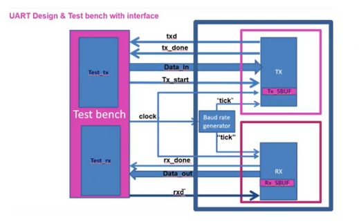
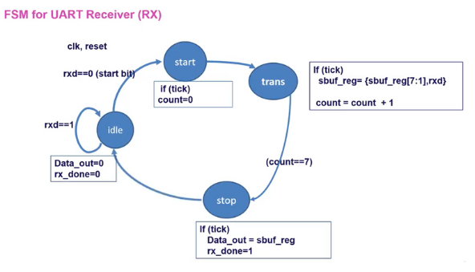
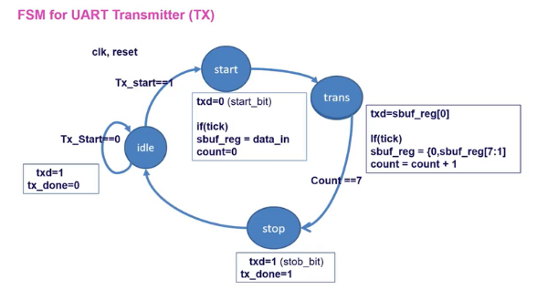
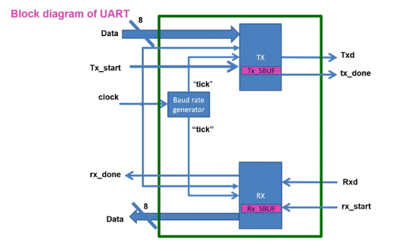
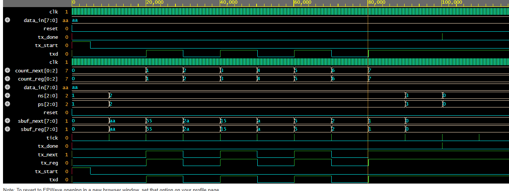
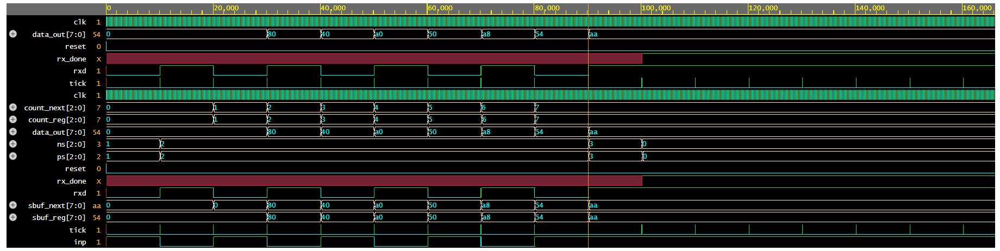

# UART_Verilog_Simulation
 
Environment: Sysnopsys VCS Simulator in EDAplayground

Simple UART communication simulation - write to learn UART protocol

#### Design

#### FSM Receiver

#### FSM Transmitter

#### UART Block

#### Mô phỏng truyền

#### Mô phỏng nhận

